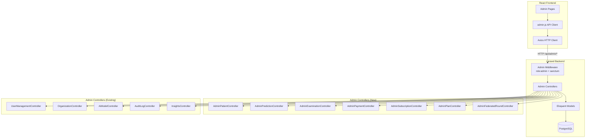
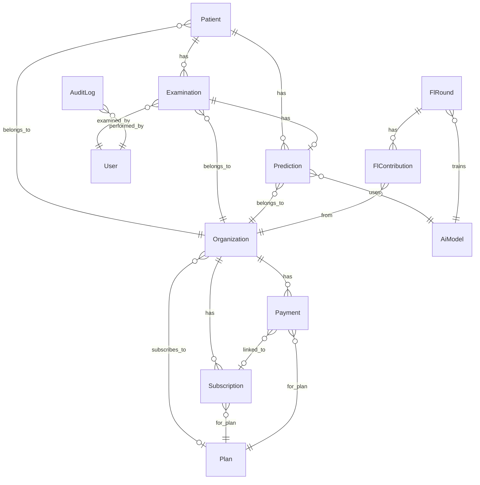

# Design Document: Admin Dashboard Enhancement

## Overview

This design covers the full-stack enhancement of the BReCAI-FED admin dashboard, transforming it from a partially-wired prototype into a fully functional platform governance center. The work spans three layers:

1. **Backend (Laravel 11)**: Seven new admin-scoped controllers providing platform-wide read access to patients, predictions, examinations, payments, subscriptions, plans, and federated learning rounds — all protected by Spatie `role:admin` middleware.

2. **API Client (React)**: Extension of the existing `src/api/api-client/admin.js` module with new resource namespaces matching the new backend endpoints.

3. **Frontend Pages (React)**: Rewiring 8 existing admin pages to use the admin API client instead of doctor/orgManager clients, removing unauthorized write controls, and adding aggregate statistics.

The architecture preserves the existing horizon design system, Zustand state management patterns, and the established controller/resource/route conventions in Laravel.

## Architecture



### Request Flow

1. React page mounts → calls `admin.<resource>.list(params)`
2. API client sends `GET /api/admin/<resource>?filters` with Sanctum cookie/token
3. Laravel middleware stack: `auth:sanctum` → `role:admin` (Spatie)
4. Controller queries Eloquent models with platform-wide scope (no org filter)
5. Returns paginated JSON response with eager-loaded relationships
6. React page renders data using design system components

### Access Control Strategy

The admin role has **full read** and **limited write** access:

| Resource | Read | Write |
|----------|------|-------|
| Users | ✅ List, Show | ✅ Create, Activate/Deactivate |
| Organizations | ✅ List, Show | ✅ Approve, Reject, Suspend |
| AI Models | ✅ List, Show | ✅ CRUD, Activate/Deactivate |
| Patients | ✅ List, Show | ❌ No CUD |
| Predictions | ✅ List, Show | ❌ No CUD |
| Examinations | ✅ List, Show | ❌ No CUD |
| Payments | ✅ List, Show | ❌ No CUD |
| Subscriptions | ✅ List, Show | ❌ No CUD |
| Plans | ✅ List, Show | ✅ CRUD, Activate/Deactivate |
| FL Rounds | ✅ List, Show | ✅ Create, Complete |
| Audit Logs | ✅ List, Show | ❌ No CUD |

## Components and Interfaces

### Backend: New Laravel Controllers

All controllers live in `App\Http\Controllers\Api\Admin\` and follow the existing pattern established by `UserManagementController` and `OrganizationController`.

#### AdminPatientController

```php
// GET /api/admin/patients
// Params: organization_id, search, age_min, age_max, page
// Returns: Paginated patients with organization relationship
// No store/update/destroy methods — read-only

public function index(Request $request): JsonResponse
public function show(Patient $patient): JsonResponse
```

#### AdminPredictionController

```php
// GET /api/admin/predictions
// Params: status, organization_id, ai_model_id, page
// Returns: Paginated predictions with patient, examination, aiModel, organization

public function index(Request $request): JsonResponse
public function show(Prediction $prediction): JsonResponse
```

#### AdminExaminationController

```php
// GET /api/admin/examinations
// Params: status, organization_id, page
// Returns: Paginated examinations with patient, doctor, organization, prediction

public function index(Request $request): JsonResponse
public function show(Examination $examination): JsonResponse
```

#### AdminPaymentController

```php
// GET /api/admin/payments
// Params: status, organization_id, page
// Returns: Paginated payments with organization, plan, subscription

public function index(Request $request): JsonResponse
public function show(Payment $payment): JsonResponse
```

#### AdminSubscriptionController

```php
// GET /api/admin/subscriptions
// Params: status, organization_id, page
// Returns: Paginated subscriptions with organization, plan

public function index(Request $request): JsonResponse
public function show(Subscription $subscription): JsonResponse
```

#### AdminPlanController

```php
// Full CRUD for subscription plans
// GET /api/admin/plans — list all plans
// POST /api/admin/plans — create plan
// PUT /api/admin/plans/{plan} — update plan
// DELETE /api/admin/plans/{plan} — delete plan (only if no active subscriptions)
// POST /api/admin/plans/{plan}/activate — activate plan
// POST /api/admin/plans/{plan}/deactivate — deactivate plan

public function index(Request $request): JsonResponse
public function store(StorePlanRequest $request): JsonResponse
public function update(StorePlanRequest $request, Plan $plan): JsonResponse
public function destroy(Plan $plan): JsonResponse
public function activate(Plan $plan): JsonResponse
public function deactivate(Plan $plan): JsonResponse
```

#### AdminFederatedRoundController

```php
// GET /api/admin/federated-rounds — list rounds with contributions count
// POST /api/admin/federated-rounds — create new round
// GET /api/admin/federated-rounds/{flRound} — show round with contributions
// POST /api/admin/federated-rounds/{flRound}/complete — complete round

public function index(Request $request): JsonResponse
public function store(Request $request): JsonResponse
public function show(FlRound $flRound): JsonResponse
public function complete(Request $request, FlRound $flRound): JsonResponse
```

### Backend: New Routes

Added to `routes/api.php` inside the existing `Route::middleware('role:admin')->prefix('admin')` group:

```php
// Patients (read-only)
Route::get('patients', [AdminPatientController::class, 'index']);
Route::get('patients/{patient}', [AdminPatientController::class, 'show']);

// Predictions (read-only)
Route::get('predictions', [AdminPredictionController::class, 'index']);
Route::get('predictions/{prediction}', [AdminPredictionController::class, 'show']);

// Examinations (read-only)
Route::get('examinations', [AdminExaminationController::class, 'index']);
Route::get('examinations/{examination}', [AdminExaminationController::class, 'show']);

// Payments (read-only)
Route::get('payments', [AdminPaymentController::class, 'index']);
Route::get('payments/{payment}', [AdminPaymentController::class, 'show']);

// Subscriptions (read-only)
Route::get('subscriptions', [AdminSubscriptionController::class, 'index']);
Route::get('subscriptions/{subscription}', [AdminSubscriptionController::class, 'show']);

// Plans (full CRUD)
Route::apiResource('plans', AdminPlanController::class);
Route::post('plans/{plan}/activate', [AdminPlanController::class, 'activate']);
Route::post('plans/{plan}/deactivate', [AdminPlanController::class, 'deactivate']);

// Federated Rounds (list, create, show, complete)
Route::get('federated-rounds', [AdminFederatedRoundController::class, 'index']);
Route::post('federated-rounds', [AdminFederatedRoundController::class, 'store']);
Route::get('federated-rounds/{flRound}', [AdminFederatedRoundController::class, 'show']);
Route::post('federated-rounds/{flRound}/complete', [AdminFederatedRoundController::class, 'complete']);
```

### Frontend: Admin API Client Extensions

New namespaces added to `src/api/api-client/admin.js`:

```javascript
// ─── Patients (read-only) ─────────────────────────────────────────────────
patients: {
  list(params = {}) {
    return client.get('/admin/patients', { params }).then(r => r.data);
  },
  get(id) {
    return client.get(`/admin/patients/${id}`).then(r => r.data);
  },
},

// ─── Predictions (read-only) ──────────────────────────────────────────────
predictions: {
  list(params = {}) {
    return client.get('/admin/predictions', { params }).then(r => r.data);
  },
  get(id) {
    return client.get(`/admin/predictions/${id}`).then(r => r.data);
  },
},

// ─── Examinations (read-only) ─────────────────────────────────────────────
examinations: {
  list(params = {}) {
    return client.get('/admin/examinations', { params }).then(r => r.data);
  },
  get(id) {
    return client.get(`/admin/examinations/${id}`).then(r => r.data);
  },
},

// ─── Payments (read-only) ─────────────────────────────────────────────────
payments: {
  list(params = {}) {
    return client.get('/admin/payments', { params }).then(r => r.data);
  },
  get(id) {
    return client.get(`/admin/payments/${id}`).then(r => r.data);
  },
},

// ─── Subscriptions (read-only) ────────────────────────────────────────────
subscriptions: {
  list(params = {}) {
    return client.get('/admin/subscriptions', { params }).then(r => r.data);
  },
  get(id) {
    return client.get(`/admin/subscriptions/${id}`).then(r => r.data);
  },
},

// ─── Plans (full CRUD) ───────────────────────────────────────────────────
plans: {
  list(params = {}) {
    return client.get('/admin/plans', { params }).then(r => r.data);
  },
  get(id) {
    return client.get(`/admin/plans/${id}`).then(r => r.data);
  },
  create(data) {
    return client.post('/admin/plans', data).then(r => r.data);
  },
  update(id, data) {
    return client.put(`/admin/plans/${id}`, data).then(r => r.data);
  },
  delete(id) {
    return client.delete(`/admin/plans/${id}`).then(r => r.data);
  },
  activate(id) {
    return client.post(`/admin/plans/${id}/activate`).then(r => r.data);
  },
  deactivate(id) {
    return client.post(`/admin/plans/${id}/deactivate`).then(r => r.data);
  },
},

// ─── Federated Rounds ─────────────────────────────────────────────────────
federatedRounds: {
  list(params = {}) {
    return client.get('/admin/federated-rounds', { params }).then(r => r.data);
  },
  get(id) {
    return client.get(`/admin/federated-rounds/${id}`).then(r => r.data);
  },
  create(data) {
    return client.post('/admin/federated-rounds', data).then(r => r.data);
  },
  complete(id, data) {
    return client.post(`/admin/federated-rounds/${id}/complete`, data).then(r => r.data);
  },
},
```

### Frontend: Page Rewiring Summary

| Page | Current API | Target API | Write Controls to Remove |
|------|-------------|------------|--------------------------|
| PatientRecords | `doctor.patients` | `admin.patients` | Create, Edit, Delete buttons |
| PredictionAudit | `doctor.predictions` | `admin.predictions` | None (already read-only) |
| ExaminationAudit | `doctor.examinations` | `admin.examinations` | None (already read-only) |
| PaymentHistory | `orgManager.payments` | `admin.payments` | None + remove org-scoped banner |
| PlansManager | `orgManager.plans` | `admin.plans` | Keep all (admin has full CRUD) |
| SubscriptionTracker | `orgManager.subscription` | `admin.subscriptions` | Remove modify controls |
| FederatedRegistry | `instructor.flRounds` | `admin.federatedRounds` | Keep create/complete (admin governs FL) |
| AIModelRegistry | `admin.aiModels` | `admin.aiModels` | Already correct — no changes needed |

### Frontend: Access Control UI Enforcement

The admin pages enforce permission boundaries at the UI level:

1. **No delete buttons** on PatientRecords, PredictionAudit, ExaminationAudit, PaymentHistory, SubscriptionTracker
2. **No edit buttons** on PatientRecords, PredictionAudit, ExaminationAudit, PaymentHistory, SubscriptionTracker
3. **No create buttons** on PatientRecords, PredictionAudit, ExaminationAudit, PaymentHistory, SubscriptionTracker
4. **Error boundary**: When a 403 response is received, display a toast with the message from the API response explaining the permission boundary

## Data Models

The design uses existing Eloquent models without schema changes. Key relationships leveraged by admin controllers:



### Key Model Fields Used by Admin Controllers

**Patient**: `id`, `patient_identifier`, `age`, `stage_num`, `er_status`, `pr_status`, `her2_binary`, `er_status_missing`, `pr_status_missing`, `organization_id`, `created_at`

**Prediction**: `id`, `examination_id`, `patient_id`, `ai_model_id`, `organization_id`, `status` (pending|processing|completed|failed), `is_lum_a`, `confidence_lum_a`, `confidence_non_lum_a`, `completed_at`, `created_at`

**Examination**: `id`, `patient_id`, `doctor_id`, `organization_id`, `chief_complaint`, `status` (draft|submitted|predicted|concluded), `examined_at`, `created_at`

**Payment**: `id`, `organization_id`, `plan_id`, `subscription_id`, `amount`, `currency` (DZD), `status` (pending|completed|failed|refunded), `duration_months`, `created_at`

**Subscription**: `id`, `organization_id`, `plan_id`, `status` (active|trialing|expired|cancelled), `starts_at`, `ends_at`, `trial_ends_at`

**Plan**: `id`, `name`, `slug`, `description`, `price`, `max_doctors`, `max_predictions_per_month`, `fl_contribution_allowed`, `instructor_allowed`, `is_active`

**FlRound**: `id`, `ai_model_id`, `round_number`, `status` (pending|in_progress|completed|failed), `global_accuracy`, `started_at`, `ended_at`

**FlContribution**: `id`, `fl_round_id`, `organization_id`, `local_sample_size`, `accuracy_before`, `accuracy_after`, `submitted_at`

## Correctness Properties

*A property is a characteristic or behavior that should hold true across all valid executions of a system — essentially, a formal statement about what the system should do. Properties serve as the bridge between human-readable specifications and machine-verifiable correctness guarantees.*

### Property 1: Admin role enforcement on all admin endpoints

*For any* admin-scoped API endpoint and *for any* authenticated user without the admin role, the backend SHALL return a 403 Forbidden response.

**Validates: Requirements 10.8**

### Property 2: Admin permission boundary restricts write operations

*For any* action attempted through the admin API, the action SHALL succeed only if it belongs to the allowed write set (approve/reject organizations, activate/deactivate users, CRUD AI models, CRUD plans, create/complete FL rounds, create users) — all other write attempts SHALL be rejected.

**Validates: Requirements 1.1**

### Property 3: API client filter parameter construction

*For any* valid combination of filter parameters (organization_id, status, search, page, ai_model_id), the admin API client SHALL construct a request URL containing exactly those parameters as query string key-value pairs, with no extraneous parameters.

**Validates: Requirements 2.1, 2.2, 2.3, 2.4, 2.5**

### Property 4: Prediction aggregate statistics correctness

*For any* set of prediction records, the computed aggregate statistics SHALL satisfy: total equals the count of all predictions, average confidence equals the mean of `confidence_lum_a` for completed predictions, completion rate equals completed count divided by total, and failure rate equals failed count divided by total.

**Validates: Requirements 4.5**

### Property 5: Examination aggregate statistics correctness

*For any* set of examination records, the computed aggregate statistics SHALL satisfy: total equals the count of all examinations, completed count equals examinations with status "concluded", pending count equals examinations with status "draft", and submitted-awaiting-AI count equals examinations with status "submitted".

**Validates: Requirements 5.5**

### Property 6: Payment financial metrics correctness

*For any* set of payment records, the computed financial metrics SHALL satisfy: total cleared revenue equals the sum of amounts where status is "completed", failed payment amount equals the sum of amounts where status is "failed", refund count equals the count where status is "refunded", and average invoice value equals total cleared revenue divided by completed payment count.

**Validates: Requirements 6.4**

### Property 7: Subscription aggregate metrics correctness

*For any* set of subscription records and a reference date, the computed metrics SHALL satisfy: total active equals count where status is "active" or "trialing", expiring-soon count equals active subscriptions where `ends_at` is within 30 days of the reference date, and churn rate equals expired count divided by (active + expired) count.

**Validates: Requirements 8.4**

### Property 8: Single active AI model invariant

*For any* sequence of model activation operations, at most one AI model SHALL have `is_active = true` at any point in time. Activating model X SHALL deactivate all other models.

**Validates: Requirements 13.3**

### Property 9: Model deletion protection

*For any* AI model that has one or more associated completed predictions, a delete operation SHALL fail and return an error message. The model record SHALL remain unchanged.

**Validates: Requirements 13.5**

## Error Handling

### Backend Error Responses

| Scenario | HTTP Status | Response Body |
|----------|-------------|---------------|
| Unauthenticated request | 401 | `{"message": "Unauthenticated."}` |
| Non-admin role | 403 | `{"message": "User does not have the right roles."}` |
| Resource not found | 404 | `{"message": "No query results for model [Model]."}` |
| Validation failure | 422 | `{"message": "...", "errors": {...}}` |
| Delete model with predictions | 422 | `{"message": "Cannot delete a model that has completed predictions."}` |
| Delete plan with active subscriptions | 422 | `{"message": "Cannot delete a plan with active subscriptions."}` |
| Complete already-completed round | 422 | `{"message": "This round is already completed."}` |
| Create round when one is active | 422 | `{"message": "There is already an active FL round for this model."}` |

### Frontend Error Handling

1. **Network errors**: Display toast with "Connection failed. Please check your network." (tone: pink)
2. **401 Unauthenticated**: Redirect to login page via existing auth interceptor
3. **403 Forbidden**: Display toast with the API message explaining the permission boundary (tone: amber)
4. **404 Not Found**: Display toast with "Resource not found" (tone: slate)
5. **422 Validation**: Display toast with the specific validation message from the API (tone: pink)
6. **500 Server Error**: Display toast with "An unexpected error occurred. Please try again." (tone: pink)

All error handling follows the existing pattern in the codebase using the `Toast` component with appropriate color tones.

## Testing Strategy

### Unit Tests (Example-Based)

**Backend (PHPUnit)**:
- Test each new controller's index method returns paginated JSON with correct structure
- Test filter parameters are applied correctly (specific examples per filter)
- Test 403 response for non-admin users on each endpoint
- Test plan CRUD operations with specific valid/invalid payloads
- Test FL round creation and completion with edge cases
- Test model deletion protection when predictions exist

**Frontend (Vitest + React Testing Library)**:
- Test each rewired page renders without errors
- Test that removed write controls (create/edit/delete buttons) are not present in read-only pages
- Test that filter dropdowns trigger correct API parameters
- Test error toast display on 403/422 responses
- Test PDF and CSV export functions produce valid output

### Property-Based Tests (fast-check)

Property-based testing is appropriate for this feature because:
- The aggregate calculation functions are pure functions with clear input/output behavior
- The API client filter construction is a pure transformation from params to URL
- The permission boundary logic has universal properties across all endpoints
- The single-active-model invariant is a state machine property

**Configuration**: Minimum 100 iterations per property test using `fast-check` library.

**Tag format**: `Feature: admin-dashboard, Property {number}: {property_text}`

Properties to implement:
1. Admin role enforcement (backend middleware test with mocked auth)
2. Permission boundary (test allowed vs disallowed action classification)
3. API client filter construction (generate random filter combos, verify URL)
4. Prediction aggregate calculations (generate random prediction arrays)
5. Examination aggregate calculations (generate random examination arrays)
6. Payment financial metrics (generate random payment arrays)
7. Subscription aggregate metrics (generate random subscription arrays with dates)
8. Single active model invariant (generate random activation sequences)
9. Model deletion protection (generate models with/without predictions)

### Integration Tests

**Backend (Laravel Feature Tests)**:
- Full request lifecycle tests for each new endpoint with seeded database
- Test pagination boundaries (page 1, last page, beyond last page)
- Test combined filter scenarios
- Test relationship eager loading returns expected nested data

**Frontend (Cypress/Playwright — optional)**:
- End-to-end flow: login as admin → navigate to each page → verify data loads
- Verify no unauthorized controls are visible
- Test filter interactions produce correct API calls
